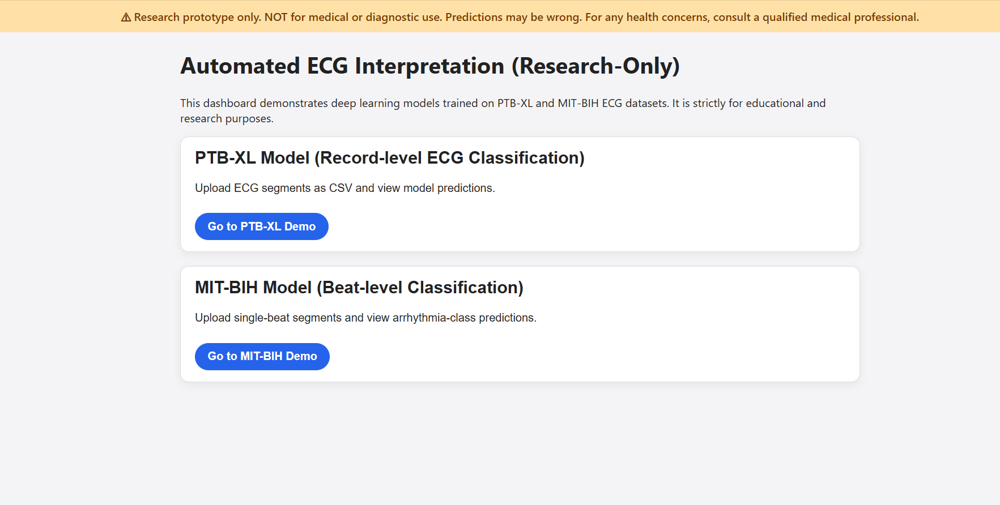
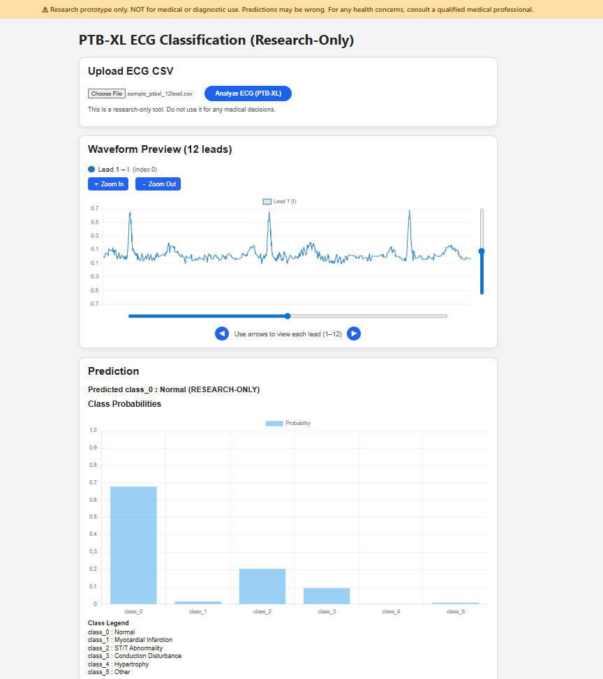
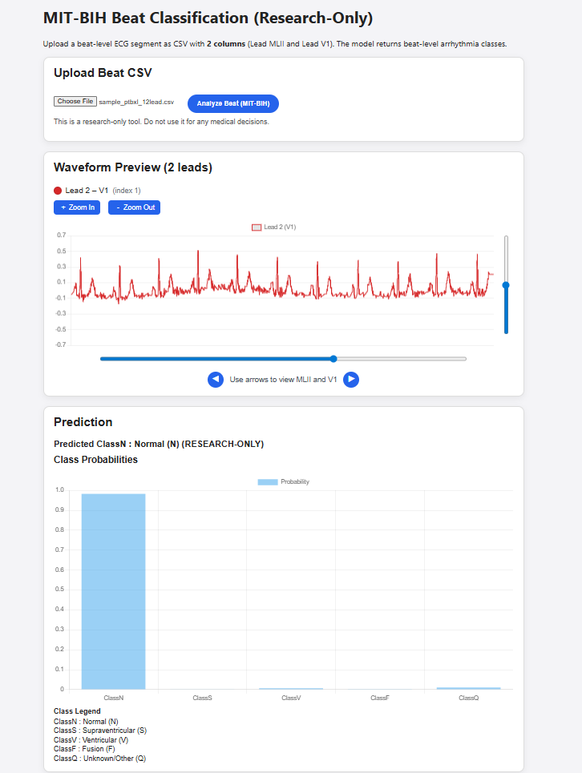

# PTB-XL & MIT-BIH ECG Classification Web App (Research-Only)

This repository contains a **full-stack ECG analysis web application** built with:

- **Flask (Python backend)**
- **HTML/CSS/JS frontend**
- **Deep learning models for ECG classification**
  - PTB-XL (12‑lead)
  - MIT-BIH Arrhythmia (2‑lead)

⚠️ **Research Prototype — NOT for medical or diagnostic use.**

---

# 🚀 Features

### ✅ PTB-XL 12‑lead ECG Viewer
- Supports CSV uploads with **12 leads**
- Smooth **horizontal zoom**
- Smooth **x-axis & y-axis sliders** (pan)
- Lead switching (1–12)
- Dynamic waveform rendering with Chart.js
- Clean Apple-style UI

### ✅ MIT-BIH 2‑lead Viewer
- Supports CSV with **MLII & V1**
- Zoom (widthwise)
- Horizontal and vertical pan sliders
- Lead switching (MLII ↔ V1)

### ✅ Classification Output
- Deep learning backend models
- Text prediction
- Probability distribution graph
- Class legend below the graph

---

# 📁 Project Structure

```
project/
│── frontend/
│   ├── static/
│   │   ├── css/
│   │   │   └── styles.css
│   │   └── js/
│   │       ├── ptbxl_stacked.js
│   │       └── mitbih.js
│   ├── templates/
│   │   ├── ptbxl.html
│   │   └── mitbih.html
│
│── models/
│   ├── ptbxl_model.h5
│   └── mitbih_model.h5
│
│── api/
│   ├── app.py
│   └── utils.py
│
│──src/
|   ├── training/
│   ├── __init__.py
│   ├── train_ptbxl.py          # Training script for PTB-XL 12-lead model
│   ├── train_mitbih.py         # Training script for MIT-BIH 2-lead model
│   ├── trainer.py     
│
|   ├── models/
│    ├── __init__.py
│    ├── ptbxl_model.py          # PTB-XL CNN model
│    ├── mitbih_model.py         # MIT-BIH 2-lead classifier (CNN)
│
|   ├── inference/
│    ├── __init__.py
│    ├── predict.py              # Contains PTBXLInferenceModel + MITBIHInferenceModel
|
|   │──data/
│    ├── ptbxl_preprocessing.py     # 12-lead preprocessing utilities
│    ├── mitbih_preprocessing.py    # 2-lead beat extraction utilities
│    └── __init__.py         
│
|   ├── utils/
│    ├── __init__.py
│    ├── metrics.py              # F1, AUC, precision, recall
│    └── config.py           
│
│── __init__.py
|
│──tests/
|  │── test_data_loading.py
|  │── test_inference_dummy.py
|
|
└── README.md
```

---

# 🛠 Installation & Setup

## 1. Clone the repo
```bash
git clone <your-repo-url>
cd project
```

## 2. Create Virtual Environment
```bash
python -m venv venv
source venv/bin/activate   # macOS / Linux
venv\Scripts activate      # Windows
```

## 3. Install Dependencies
```bash
pip install -r requirements.txt
```

Common packages:
```
flask
tensorflow / torch
numpy
pandas
chart.js (frontend)
```

---

# ▶️ Running the Server (Localhost)

```bash
cd api
python app.py
```

Server starts at:

```
http://localhost:5000
```

---

# 🔌 API Endpoints

## **POST /api/predict_ecg_ptbxl**
Upload a CSV → Get PTB-XL prediction

---

## **POST /api/predict_ecg_mitbih**
Upload a CSV → Get MIT-BIH prediction

---


# 📸 Screenshots 








---

# 🔮 Future Improvements
- Multi‑model inference engine
- Real‑time ECG streaming support
- Medical-grade UI theme
- Add R-peak detection
- Add HRV metrics
- Implement noise filtering

---

# 📝 License
MIT License.

---

# ❤️ Credits
- PTB-XL dataset authors  
- MIT-BIH Arrhythmia dataset authors  
- Chart.js  
- Flask Framework  

---

# 📌 Disclaimer
This project is **NOT** a medical device.  
This is for **research, education, and hackathon use** only.  
Do NOT rely on predictions for health decisions.
